# Chapter 1: Basics and Mechanism of Autoencoders

## 1.1 Architecture Overview

An autoencoder consists of three main components:

### **1. Encoder Network**
- Takes high-dimensional input data
- Progressively reduces dimensionality through layers
- Output is a compressed representation (latent vector)
- Maps: Input Space (high-dim) → Latent Space (low-dim)

### **2. Bottleneck (Latent Layer)**
- The compressed representation of the input
- Has the smallest number of neurons
- Serves as the "information bottleneck"
- Forces the network to learn only the essential features

### **3. Decoder Network**
- Takes the compressed representation
- Progressively increases dimensionality back to original size
- Attempts to reconstruct the original input
- Maps: Latent Space (low-dim) → Output Space (high-dim)

## 1.2 Architecture Diagram

```mermaid
graph LR
    subgraph Input["Input Layer (D dimensions)"]
        I1["x1"]; I2["x2"]; I3["x3"]; I4["..."]
    end
    
    subgraph Encoder["Encoder"]
        E1["Hidden Layer 1<br/>D1 neurons"]; 
        E2["Hidden Layer 2<br/>D2 neurons"];
        E3["Hidden Layer 3<br/>D3 neurons"]
    end
    
    subgraph Bottleneck["Bottleneck Layer<br/>k neurons<br/>(k << D)"]
        B["z1, z2, ..., zk"]
    end
    
    subgraph Decoder["Decoder"]
        D1["Hidden Layer 3<br/>D3 neurons"]; 
        D2["Hidden Layer 2<br/>D2 neurons"];
        D3["Hidden Layer 1<br/>D1 neurons"]
    end
    
    subgraph Output["Reconstructed Output<br/>D dimensions"]
        O1["x̂1"]; O2["x̂2"]; O3["x̂3"]; O4["..."]
    end
    
    I1 --> E1; I2 --> E1; I3 --> E1; I4 --> E1
    E1 --> E2 --> E3 --> B
    B --> D1 --> D2 --> D3
    D3 --> O1; D3 --> O2; D3 --> O3; D3 --> O4
    
    style Bottleneck fill:#ff9999
    style Input fill:#99ccff
    style Output fill:#99ff99
```



## 1.3 Data Flow and Mathematical Formulation

### **Forward Pass**

**Encoding Phase:**
$$a = g(\mathbf{x}) = \sigma(W_e \mathbf{x} + b_e)$$

Where:
- $\mathbf{x}$ = input vector
- $W_e$ = encoder weight matrix
- $b_e$ = encoder bias
- $\sigma$ = activation function (ReLU, sigmoid, tanh, etc.)
- $a$ = encoded representation (latent vector)

**Decoding Phase:**
$$\hat{\mathbf{x}} = h(a) = \sigma(W_d a + b_d)$$

Where:
- $W_d$ = decoder weight matrix
- $b_d$ = decoder bias
- $\hat{\mathbf{x}}$ = reconstructed output

### **Complete Forward Pass**
$$\hat{\mathbf{x}} = h(g(\mathbf{x})) = \text{Decoder}(\text{Encoder}(\mathbf{x}))$$

## 1.4 Loss Function

The autoencoder is trained by minimizing the **reconstruction loss**:

$$L(\mathbf{x}, \hat{\mathbf{x}}) = ||\mathbf{x} - \hat{\mathbf{x}}||^2$$

This is typically the **Mean Squared Error (MSE)**:

$$L = \frac{1}{n}\sum_{i=1}^{n}(\mathbf{x}_i - \hat{\mathbf{x}}_i)^2$$

For binary data, **Binary Cross-Entropy** might be used:

$$L = -\frac{1}{n}\sum_{i=1}^{n}[\mathbf{x}_i \log(\hat{\mathbf{x}}_i) + (1-\mathbf{x}_i)\log(1-\hat{\mathbf{x}}_i)]$$

## 1.5 Training Process

The autoencoder learns through standard backpropagation:

### **Step-by-Step Training**


### **Pseudo-code for Training Loop**

```python
for epoch in range(num_epochs):
    total_loss = 0
    for batch in training_data:
        # 1. Forward pass
        latent = encoder(batch)
        reconstruction = decoder(latent)
        
        # 2. Calculate loss
        loss = mse_loss(batch, reconstruction)
        
        # 3. Backward pass
        loss.backward()
        
        # 4. Update weights
        optimizer.step()
        optimizer.zero_grad()
        
        total_loss += loss.item()
    
    print(f"Epoch {epoch}, Loss: {total_loss/len(training_data)}")
```

## 1.6 Activation Functions in Autoencoders

Different layers use different activation functions:

### **Encoder Layers**
| Activation | Formula | Use Case |
|-----------|---------|----------|
| **ReLU** | $\max(0, x)$ | Default choice, fast computation |
| **Leaky ReLU** | $\max(0.01x, x)$ | Avoid dead neurons |
| **ELU** | $x$ if $x>0$ else $\alpha(e^x-1)$ | Smooth gradients |
| **Sigmoid** | $\frac{1}{1+e^{-x}}$ | Squash to [0,1] |
| **Tanh** | $\frac{e^x - e^{-x}}{e^x + e^{-x}}$ | Squash to [-1,1] |

### **Latent Layer**
- Usually **no activation** (linear)
- Allows full range of values for representation

### **Decoder Output Layer**
- **Sigmoid**: For images (output in [0,1])
- **Tanh**: For centered data (output in [-1,1])
- **Linear**: For unbounded reconstruction
- **Softmax**: For probability distributions

## 1.7 Latent Space Representation

The latent space is the key to understanding autoencoders:

### **Properties of Latent Space**

**Compressed Dimension:**
- Original: 28×28 = 784 dimensions (MNIST image)
- Latent: 32 dimensions (typical choice)
- **Compression ratio**: 784/32 ≈ 24.5x

**Learned Representation:**
- Captures underlying factors of variation
- Similar inputs map to nearby latent points
- Smooth interpolation is possible

**Visualization Example (2D Latent Space):**

```mermaid
graph TB
    subgraph Latent["Latent Space<br/>(2 dimensions)"]
        P1["📊 Cluster 1<br/>Similar to input A"]
        P2["🎵 Cluster 2<br/>Similar to input B"]
        P3["🌊 Cluster 3<br/>Similar to input C"]
    end
    
    style P1 fill:#ffcccc
    style P2 fill:#ccffcc
    style P3 fill:#ccccff
```



## 1.8 Encoder-Decoder Symmetry

Most autoencoders have **symmetric architecture**:

### **Typical Configuration**

**Encoder:** 784 → 512 → 256 → 128 → 32
- Reduces by factor of 2 at each layer

**Decoder:** 32 → 128 → 256 → 512 → 784
- Increases by factor of 2 at each layer (mirror of encoder)

This symmetry is useful but not required. **Asymmetric architectures** are also valid.

## 1.9 Key Hyperparameters

| Parameter | Impact | Typical Values |
|-----------|--------|-----------------|
| **Latent Dimension** | Smaller = more compression, larger = better reconstruction | 32, 64, 128 |
| **Encoder Depth** | More layers = more capacity but harder to train | 2-4 layers |
| **Hidden Layer Size** | Capacity of intermediate representations | 256, 512, 1024 |
| **Activation Function** | Non-linearity, training dynamics | ReLU, Tanh |
| **Learning Rate** | Convergence speed and stability | 0.001, 0.0001 |
| **Batch Size** | Training stability and speed | 32, 64, 128 |
| **Regularization** | Prevent overfitting | L1, L2, Dropout |

## 1.10 Common Issues and Solutions

### **Issue 1: Blurry Reconstructions**

**Cause**: Latent dimension too small, network underfitting

**Solutions**:
- Increase latent dimension
- Add more layers
- Increase training epochs

### **Issue 2: Overfitting**

**Cause**: Network learning noise instead of general features

**Solutions**:
- Add dropout regularization
- Use L1/L2 regularization
- Increase latent dimension (forces compression)
- Use denoising autoencoder variant

### **Issue 3: Training Divergence**

**Cause**: Learning rate too high, gradient explosion

**Solutions**:
- Reduce learning rate
- Use batch normalization
- Implement gradient clipping
- Use Adam optimizer (adaptive learning rates)

### **Issue 4: Dead Neurons**

**Cause**: ReLU units can get stuck at 0

**Solutions**:
- Use Leaky ReLU or ELU
- Adjust learning rate
- Use batch normalization

## 1.11 Information Bottleneck Principle

The core principle of autoencoders:


**The Tradeoff:**
- **Smaller latent space**: Stronger compression, more information loss
- **Larger latent space**: Better reconstruction, less compression

The optimal size balances:
$$\text{Compression Ratio} \text{ vs } \text{Reconstruction Quality}$$

## 1.12 Comparison: Shallow vs Deep Autoencoders

### **Shallow Autoencoder**
```
Input (784) → Hidden (256) → Latent (32) → Hidden (256) → Output (784)
```
- **Pros**: Fast training, simple
- **Cons**: Limited capacity, struggles with complex patterns

### **Deep Autoencoder**
```
Input (784) → 512 → 256 → 128 → Latent (32) → 128 → 256 → 512 → Output (784)
```
- **Pros**: Learns hierarchical representations, better compression
- **Cons**: Harder to train, requires careful tuning

## Summary

Autoencoders work through a simple yet powerful mechanism:
1. **Compress** data into a bottleneck layer
2. **Reconstruct** the original data from the compressed representation
3. **Learn** by minimizing reconstruction error
4. **Extract** meaningful features through the information bottleneck

This forces the network to discover the essential structure in the data without explicit supervision.

---

**Next**: Chapter 2 explores specific applications and different types of autoencoders suited for various tasks.
