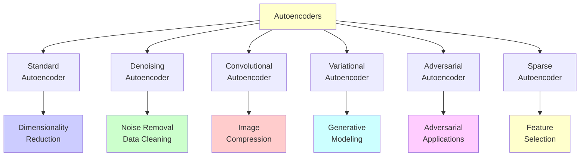
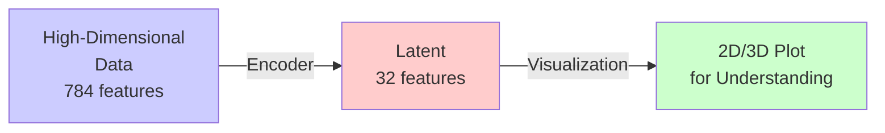
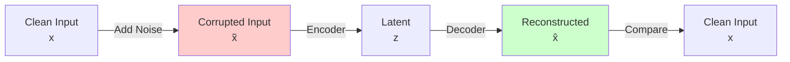
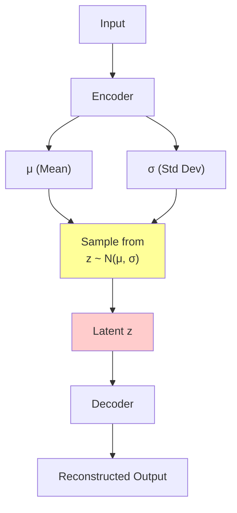
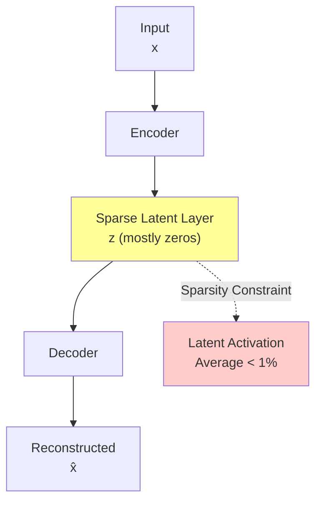
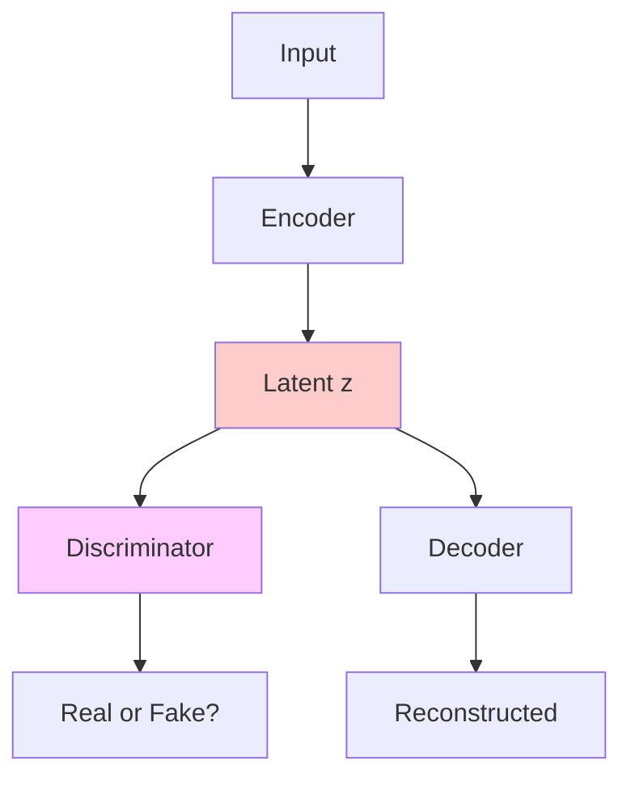
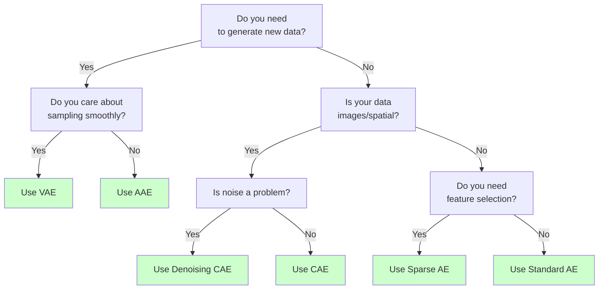

# Chapter 2: Applications and Types of Autoencoders

## 2.1 Overview of Autoencoder Variants

Different types of autoencoders are designed for specific applications:



## 2.2 Standard (Vanilla) Autoencoder

### **Architecture**
- Fully connected layers
- Symmetric encoder-decoder structure
- Minimizes MSE reconstruction loss

### **Applications**

#### **1. Dimensionality Reduction**
- **Problem**: High-dimensional data is hard to visualize and process
- **Solution**: Compress to 2-3 dimensions
- **Use Case**: 
  - MNIST digits: 784D → 32D
  - Images: 65536D → 128D
  


#### **2. Feature Learning**
- **Problem**: Manual feature engineering is time-consuming
- **Solution**: Learn representations automatically
- **Use Case**: Transfer learning with pre-trained encoder

**Example Workflow:**
```
1. Train autoencoder on unlabeled data
2. Extract encoder weights
3. Use encoder as feature extractor for supervised task
4. Fine-tune on labeled data
```

#### **3. Data Compression**
- **Problem**: Storage and transmission of large files
- **Solution**: Compress via latent representation
- **Use Case**:
  - Image compression (JPEG-like)
  - Video frame compression
  - Document compression

### **Hyperparameter Tuning**

| Parameter | Impact | Recommendation |
|-----------|--------|-----------------|
| Latent Size | Compression ratio | Start with 5-10% of input size |
| Encoder Layers | Capacity | 2-4 layers typically |
| Learning Rate | Convergence | 0.001 for Adam |
| Batch Size | Training stability | 32-128 |

## 2.3 Denoising Autoencoder (DAE)

### **Architecture**
- Input: Corrupted data
- Output: Clean data
- Training: Add noise → Reconstruct clean version

### **How It Works**



### **Mathematical Formulation**

**Training Process:**
1. Start with clean input $\mathbf{x}$
2. Add noise: $\tilde{\mathbf{x}} = \mathbf{x} + \boldsymbol{\epsilon}$
3. Encode corrupted input: $a = g(\tilde{\mathbf{x}})$
4. Decode: $\hat{\mathbf{x}} = h(a)$
5. Minimize loss against **clean** input:
$$L = ||\mathbf{x} - \hat{\mathbf{x}}||^2$$

**At Test Time:**
- Feed noisy input
- Network reconstructs clean version
- No need for explicit noise model

### **Types of Noise**

| Noise Type | Formula | Application |
|-----------|---------|-------------|
| **Gaussian Noise** | $\tilde{x} = x + \mathcal{N}(0, \sigma^2)$ | General-purpose |
| **Salt-and-Pepper** | Random pixels to 0 or 1 | Image corruption |
| **Dropout Noise** | Randomly zero neurons | Robustness training |
| **Masking Noise** | Randomly mask regions | Inpainting |

### **Applications**

#### **1. Image Denoising**
- **Problem**: Photos corrupted by sensor noise or compression
- **Solution**: Train on noisy-clean pairs
- **Example**: Medical imaging, low-light photos

```
Medical Image (noisy) → DAE → Clean Medical Image
```

#### **2. Missing Data Imputation**
- **Problem**: Datasets with missing values
- **Solution**: Mask missing values as "noise"
- **Example**: User preferences in recommendation systems

```
User ratings (some missing) → DAE → Imputed ratings
```

#### **3. Robust Feature Learning**
- **Problem**: Features should be robust to small perturbations
- **Solution**: Train with noisy inputs
- **Example**: Speech recognition on noisy audio

#### **4. Data Augmentation**
- **Problem**: Limited training data
- **Solution**: Generate clean versions from noisy variants
- **Example**: Augment datasets for better generalization

### **Key Advantage**
The denoising autoencoder learns a **regularized representation** that's:
- Robust to input variations
- Captures essential features
- Better for downstream tasks than vanilla autoencoder

## 2.4 Convolutional Autoencoder (CAE)

### **Architecture**
- Uses convolutional layers in encoder
- Uses transpose/deconvolutional layers in decoder
- Preserves spatial structure of images

### **Why Convolution?**

**Problems with Fully Connected:**
- Treats images as 1D vectors
- Doesn't preserve spatial relationships
- Too many parameters for large images

**Advantages of Convolution:**
- Learns local features (edges, textures)
- Parameter sharing reduces model size
- Preserves 2D structure naturally

### **Architecture Comparison**

```mermaid
graph TB
    subgraph FC["Fully Connected Autoencoder"]
        A1["Input: 28×28×1"] --> B1["Flatten: 784D"]
        B1 --> C1["Dense: 256D"]
        C1 --> D1["Dense: 64D (Latent)"]
        D1 --> E1["Dense: 256D"]
        E1 --> F1["Dense: 784D"]
        F1 --> G1["Reshape: 28×28×1"]
    end
    
    subgraph CV["Convolutional Autoencoder"]
        A2["Input: 28×28×1"] 
        A2 --> B2["Conv: 16 filters, 3×3<br/>Output: 28×28×16"]
        B2 --> C2["MaxPool: 2×2<br/>Output: 14×14×16"]
        C2 --> D2["Conv: 32 filters, 3×3<br/>Output: 14×14×32"]
        D2 --> E2["MaxPool: 2×2<br/>Output: 7×7×32"]
        E2 --> F2["Flatten: 1568D<br/>(Bottleneck)"]
        F2 --> G2["Reshape: 7×7×32"]
        G2 --> H2["UpSample: 2×2<br/>Output: 14×14×32"]
        H2 --> I2["ConvTranspose: 16 filters<br/>Output: 14×14×16"]
        I2 --> J2["UpSample: 2×2<br/>Output: 28×28×16"]
        J2 --> K2["ConvTranspose: 1 filter<br/>Output: 28×28×1"]
    end
    
    style D1 fill:#ffcccc
    style F2 fill:#ffcccc
```



### **Encoder Architecture Example**

```
Input (28×28×1)
    ↓ Conv(3×3, 16 filters) + ReLU
Output (28×28×16)
    ↓ MaxPool(2×2)
Output (14×14×16)
    ↓ Conv(3×3, 32 filters) + ReLU
Output (14×14×32)
    ↓ MaxPool(2×2)
Latent (7×7×32) = 1,568 features
```

### **Decoder Architecture Example**

```
Latent (7×7×32)
    ↓ Reshape to proper format
Output (7×7×32)
    ↓ UpSample(2×2)
Output (14×14×32)
    ↓ ConvTranspose(3×3, 16 filters) + ReLU
Output (14×14×16)
    ↓ UpSample(2×2)
Output (28×28×16)
    ↓ ConvTranspose(3×3, 1 filter) + Sigmoid
Reconstructed (28×28×1)
```

### **Applications**

#### **1. Image Compression**
- **Problem**: Large file sizes for storage/transmission
- **Solution**: Compress via latent space
- **Example**: JPEG alternative with learned compression
- **Compression Ratio**: 10:1 to 100:1 possible

```
Original Image (28×28×3 = 2,352 bytes)
    ↓ CAE Encoder
Latent (7×7×8 = 392 features)
    ↓ CAE Decoder
Reconstructed Image (28×28×3)
```

#### **2. Image Reconstruction**
- **Problem**: Incomplete or damaged images
- **Solution**: Train on full images, inpaint at test time
- **Example**: Old photo restoration, satellite imagery

#### **3. Feature Extraction**
- **Problem**: Need discriminative features for classification
- **Solution**: Use learned representations from encoder
- **Example**: Pre-training for image classification

#### **4. Anomaly Detection**
- **Problem**: Identify unusual/defective items
- **Solution**: High reconstruction error = anomaly
- **Example**: Manufacturing quality control

```
Normal Product → CAE → Low Reconstruction Error
Defective Item → CAE → High Reconstruction Error
```

### **Key Advantages**

| Advantage | Benefit |
|-----------|---------|
| **Fewer Parameters** | Faster training, less memory |
| **Spatial Awareness** | Better for structured data like images |
| **Better Features** | Learns hierarchical visual features |
| **Scalability** | Can handle high-resolution images |

## 2.5 Variational Autoencoder (VAE)

### **Key Difference from Standard AE**

**Standard AE**: Learns a fixed mapping
$$\mathbf{x} \rightarrow z \rightarrow \hat{\mathbf{x}}$$

**VAE**: Learns a **probability distribution** over latent space
$$\mathbf{x} \rightarrow P(z|\mathbf{x}) \rightarrow \hat{\mathbf{x}}$$

### **Architecture**



### **Loss Function**

VAEs use a special loss combining:
1. **Reconstruction Loss**: Standard MSE/BCE
2. **KL Divergence**: Ensures latent space is close to prior $\mathcal{N}(0,1)$

$$L_{VAE} = L_{reconstruction} + \beta \cdot D_{KL}(q(z|x) || p(z))$$

Where:
- $q(z|x)$ = learned distribution (encoder)
- $p(z)$ = prior distribution (usually standard normal)
- $\beta$ = weighting factor (controls generation vs reconstruction)

### **Applications**

#### **1. Generative Modeling**
- **Problem**: Generate new data similar to training data
- **Solution**: Sample from learned latent distribution
- **Example**: Generate new faces, handwritten digits

```
Sample z ~ N(0,1) → VAE Decoder → New Image
```

#### **2. Interpolation and Morphing**
- **Problem**: Create smooth transitions between data points
- **Solution**: Interpolate in latent space
- **Example**: Face morphing, image blending

```
Image A → Encode → z_A
Image B → Encode → z_B
t·z_A + (1-t)·z_B → Decode → Intermediate Image (for t ∈ [0,1])
```

#### **3. Semi-Supervised Learning**
- **Problem**: Limited labeled data
- **Solution**: Pre-train VAE on unlabeled data
- **Example**: Classification with mostly unlabeled examples

#### **4. Disentangled Representations**
- **Problem**: Separate factors of variation
- **Solution**: Use β-VAE or Factor-VAE
- **Example**: Separate rotation, scale, position in images

### **When to Use VAE**

✅ **Good for:**
- Generating new samples
- Interpretable latent spaces
- Smooth interpolation between examples
- Semi-supervised learning

❌ **Not ideal for:**
- Pixel-perfect reconstruction (blurry outputs)
- When generation isn't needed
- Limited training data

## 2.6 Sparse Autoencoder

### **Concept**
Restrict the number of active neurons in the latent layer



### **Loss Function**

Adds sparsity penalty:
$$L = L_{reconstruction} + \lambda \cdot L_{sparsity}$$

Sparsity can be enforced with:
- **KL Divergence**: Prefer low activation rates
- **L1 Regularization**: Encourage zeros
- **Binary Masks**: Only activate top-k neurons

### **Applications**

#### **1. Feature Selection**
- **Problem**: Identify important features from high-dimensional data
- **Solution**: Active neurons = important features
- **Example**: Gene selection in genomics

#### **2. Interpretability**
- **Problem**: Understand what features matter
- **Solution**: Only few active units per output
- **Example**: Medical diagnosis explanation

#### **3. Efficient Storage**
- **Problem**: Sparse latent codes compress better
- **Solution**: Use sparse representations
- **Example**: Semantic hashing, efficient indexing

## 2.7 Adversarial Autoencoder (AAE)

### **Hybrid Approach**
Combines autoencoders with GANs (Generative Adversarial Networks)



### **Two Training Objectives**

1. **Reconstruction Objective**
   - Standard autoencoder loss
   - Minimize: $||x - \text{Decoder}(\text{Encoder}(x))||^2$

2. **Adversarial Objective**
   - Discriminator distinguishes encoded vs prior
   - Generator (encoder) fools discriminator
   - Ensures $q(z) \approx p(z)$

### **Applications**

#### **1. Flexible Generation**
- More stable than VAE
- Higher quality than VAE
- Flexible latent space structure

#### **2. Clustering**
- Learn cluster structure in latent space
- Categorical variables in latent layer
- Example: Unsupervised classification

## 2.8 Application Selection Guide

Use this flowchart to choose the right autoencoder:



## 2.9 Comparison Table

| Type | Input Type | Output | Generation | Noise Robust | Interpretable |
|------|-----------|--------|-----------|--------------|--------------|
| **Standard** | Any | Reconstruction | ❌ | ❌ | Medium |
| **Denoising** | Noisy data | Clean version | ❌ | ✅ | Medium |
| **Convolutional** | Images | Image | ❌ | ❌ | Medium |
| **Variational** | Any | Reconstruction + New samples | ✅ | ❌ | High |
| **Sparse** | High-dim | Sparse features | ❌ | ❌ | ✅ |
| **Adversarial** | Any | Reconstruction + New samples | ✅ | ❌ | Low |

## 2.10 Real-World Application Examples

### **1. Medical Imaging**
- **Problem**: Noisy CT/MRI scans
- **Solution**: Denoising autoencoder
- **Benefit**: Improved diagnosis accuracy

### **2. Recommendation Systems**
- **Problem**: Missing user ratings
- **Solution**: DAE for imputation
- **Benefit**: Better recommendations with sparse data

### **3. Facial Recognition**
- **Problem**: Recognize faces from low-resolution images
- **Solution**: CAE pre-training + fine-tuning classifier
- **Benefit**: Better features with limited labeled data

### **4. Fraud Detection**
- **Problem**: Detect unusual transaction patterns
- **Solution**: CAE with anomaly detection (high reconstruction error)
- **Benefit**: Identify fraudulent transactions

### **5. Drug Discovery**
- **Problem**: Generate novel drug molecules
- **Solution**: VAE on chemical fingerprints
- **Benefit**: Accelerate drug development

### **6. Content Moderation**
- **Problem**: Flag inappropriate content
- **Solution**: Sparse AE for feature selection
- **Benefit**: Understand which features trigger flags

## Summary

Each autoencoder type excels in different scenarios:
- **Standard**: General dimensionality reduction
- **Denoising**: Robust features and noise removal
- **Convolutional**: Image processing
- **Variational**: Generative tasks
- **Sparse**: Interpretability and feature selection
- **Adversarial**: High-quality generation with reconstruction

---

**Next**: Chapter 3 provides TensorFlow implementations of three key autoencoder types with complete working code.
