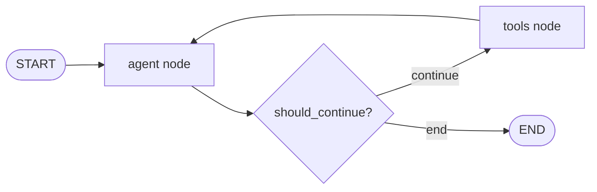

# LangGraph ReACT Agent with Native Graph Architecture

A custom implementation of a ReACT (Reasoning and Acting) Agent using LangGraph's native StateGraph with explicit nodes, edges, START and END states. This implementation does **not** use readymade `create_agent` functions, providing full control over the agent's behavior.

## Architecture

### Graph Structure

```
START → agent → [conditional] → tools → agent → ... → END
```

The agent follows a cyclic pattern:
1. **agent node**: Calls the LLM to reason about the task
2. **conditional edge**: Decides whether to continue to tools or end
3. **tools node**: Executes requested tools
4. **Loop back**: Returns to agent with tool results

### Key Components

#### 1. **ReACTAgent Class**
The main agent class that users configure directly:

```python
from langgraph_react_agent import ReACTAgent

agent = ReACTAgent(
    model="gpt-4o",              # Specify any model
    temperature=0.1,              # Control randomness
    system_prompt="Custom prompt", # Define agent behavior
    tools=my_tools,               # Provide tools
    max_iterations=15,            # Limit reasoning cycles
    use_sqlite_checkpoint=True    # Enable persistence
)
```

#### 2. **State Management**
Uses LangGraph's `StateGraph` with `AgentState`:

```python
class AgentState(TypedDict):
    messages: Annotated[Sequence[BaseMessage], add_messages]
```

#### 3. **Nodes**

- **`agent` node** (`_call_model`): Invokes the LLM with conversation history
- **`tools` node** (`_execute_tools`): Executes tools using LangGraph's `ToolNode`

#### 4. **Edges**

- `START → agent`: Entry point
- `agent → [conditional]`: Check if tools needed or done
- `conditional → tools`: Execute tools (if tool calls present)
- `conditional → END`: Finish (if no tool calls)
- `tools → agent`: Loop back with results

## Usage

### Basic Example

```python
import asyncio
from langgraph_react_agent import ReACTAgent

async def main():
    # Create agent with custom configuration
    agent = ReACTAgent(
        model="gpt-4o-mini",
        temperature=0.7,
        system_prompt="You are a helpful assistant.",
        max_iterations=10
    )
    
    # Use the agent
    result = await agent.ainvoke("What is 2+2?")
    print(result["messages"][-1].content)

asyncio.run(main())
```

### With MCP Tools

```python
from langgraph_react_agent import create_react_agent_with_mcp

async def main():
    # Create agent with MCP tools
    agent, runner, mcp_manager = await create_react_agent_with_mcp(
        model="gpt-4o",
        temperature=0.1,
        include_todo_tools=True,
        include_shell_tool=True
    )
    
    try:
        # Run queries
        result = await runner.run("List Python files in the workspace")
        print(result["messages"][-1].content)
    finally:
        await mcp_manager.disconnect()

asyncio.run(main())
```

### Interactive Mode

```bash
python langgraph_react_agent.py --interactive
```

Commands:
- `/new` - Start new conversation thread
- `/stream` - Toggle streaming mode
- `/quit` - Exit

### Demo Mode

```bash
python langgraph_react_agent.py --demo
```

## Features

### 1. **Custom Model Selection**
Specify any model supported by LangChain:

```python
agent = ReACTAgent(model="claude-3-5-sonnet-20241022")
agent = ReACTAgent(model="gpt-4o")
agent = ReACTAgent(model="gemini-2.0-flash-exp")
```

### 2. **Custom System Prompts**
Full control over agent behavior:

```python
agent = ReACTAgent(
    model="gpt-4o",
    system_prompt="""You are a specialized code reviewer.
    Focus on: security, performance, best practices."""
)
```

### 3. **Checkpointing**
Conversation persistence with thread support:

```python
# In-memory (default)
agent = ReACTAgent(model="gpt-4o", use_sqlite_checkpoint=False)

# SQLite persistence
agent = ReACTAgent(
    model="gpt-4o",
    use_sqlite_checkpoint=True,
    sqlite_path="./my_checkpoints.db"
)

# Use with threads
result = await agent.ainvoke(
    "Hello",
    config={"configurable": {"thread_id": "user-123"}}
)
```

### 4. **MCP Tool Integration**
Access to three MCP servers:

1. **Filesystem Server** - Read, write, edit files
2. **Search Server** - Web search, Wikipedia, URL fetching
3. **Subagent Server** - Code review, debugging, testing tools

### 5. **Additional Tools**

```python
# Todo list management
include_todo_tools=True  # Adds write_todos, read_todos

# Shell command execution
include_shell_tool=True  # Adds run_shell_command
```

### 6. **Iteration Control**
Prevent infinite loops:

```python
agent = ReACTAgent(
    model="gpt-4o",
    max_iterations=20  # Max reasoning cycles
)
```

## API Reference

### ReACTAgent

```python
class ReACTAgent:
    def __init__(
        model: str = "gpt-4o",
        temperature: float = 0.1,
        system_prompt: Optional[str] = None,
        tools: Optional[List[BaseTool]] = None,
        max_iterations: int = 15,
        use_sqlite_checkpoint: bool = False,
        sqlite_path: str = "./checkpoints.db"
    )
    
    async def ainvoke(
        messages: Union[str, List[BaseMessage], Dict],
        config: Optional[Dict] = None
    ) -> Dict[str, Any]
    
    def invoke(
        messages: Union[str, List[BaseMessage], Dict],
        config: Optional[Dict] = None
    ) -> Dict[str, Any]
    
    async def astream_events(
        messages: Union[str, List[BaseMessage], Dict],
        config: Optional[Dict] = None,
        **kwargs
    )
    
    def add_tools(tools: List[BaseTool]) -> None
    def set_system_prompt(prompt: str) -> None
```

### Helper Functions

```python
async def create_react_agent_with_mcp(
    model: str = "gpt-4o",
    temperature: float = 0.1,
    system_prompt: Optional[str] = None,
    use_sqlite: bool = False,
    max_iterations: int = 15,
    include_todo_tools: bool = True,
    include_shell_tool: bool = True
) -> Tuple[ReACTAgent, ReACTAgentRunner, MCPToolManager]

async def quick_chat(
    message: str,
    model: str = "gpt-4o"
) -> str
```

## Examples

See `example_react_agent.py` for comprehensive examples:

1. **Basic agent** without tools
2. **Agent with MCP tools**
3. **Custom configuration**
4. **Checkpointing and memory**
5. **Direct usage patterns**

Run examples:
```bash
python example_react_agent.py
```

## Testing

Run the test suite:
```bash
python test_langgraph_agent.py
```

Individual tests:
```bash
python test_langgraph_agent.py mcp      # Test MCP connection
python test_langgraph_agent.py agent    # Test agent creation
python test_langgraph_agent.py invoke   # Test invocation
python test_langgraph_agent.py tools    # Test tool usage
python test_langgraph_agent.py memory   # Test checkpointing
```

## Requirements

```bash
pip install -r requirements.txt
```

Key dependencies:
- `langchain>=1.0.0`
- `langgraph>=0.2.0`
- `langchain-mcp-adapters>=0.1.0`
- `mcp>=1.0.0`

## Environment Setup

Create a `.env` file:

```bash
# Required for agent functionality
OPENAI_API_KEY=your_key_here

# Optional for search server
TAVILY_API_KEY=your_key_here

# Optional for subagent server
MCP_SUBAGENT_MODEL=gpt-4o-mini
```

## Architecture Benefits

### Why Native Graph Construction?

1. **Full Control**: Direct access to nodes, edges, and state
2. **Transparency**: Clear understanding of agent flow
3. **Customization**: Easy to modify or extend the graph
4. **Debugging**: Explicit control flow aids troubleshooting
5. **Learning**: Better understanding of ReACT pattern

### Comparison with `create_agent`

| Feature | Native Graph (This) | `create_agent` |
|---------|-------------------|----------------|
| Control | Full control | Abstracted |
| Customization | Highly customizable | Limited |
| Learning curve | Steeper | Easier |
| Flexibility | Maximum | Moderate |
| Middleware | Manual integration | Built-in |

## Graph Visualization

The agent uses this graph structure:



## License

MIT

## Contributing

Contributions welcome! Please ensure:
1. Tests pass: `python test_langgraph_agent.py`
2. Code follows existing patterns
3. Documentation is updated

## Acknowledgments

- Built with [LangGraph](https://github.com/langchain-ai/langgraph)
- Uses [MCP (Model Context Protocol)](https://modelcontextprotocol.io/)
- Implements the ReACT pattern from [Yao et al., 2022](https://arxiv.org/abs/2210.03629)
