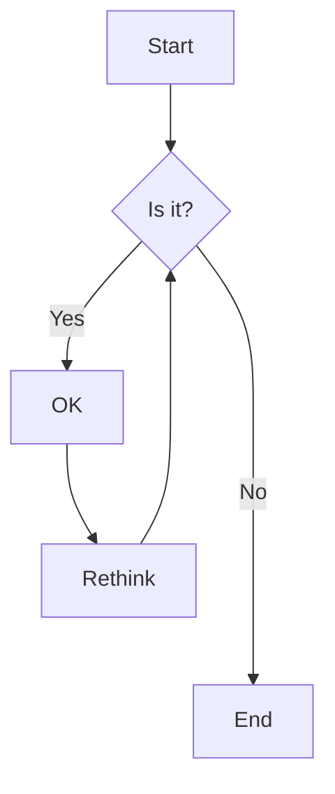

# Introduction to Mathematics and Diagrams

This chapter introduces mathematical notation and diagram rendering in our PDF book.

## Mathematical Equations

Here's an inline equation: $`E = mc^2`$

And here's a display equation:

```math
\int_{-\infty}^{\infty} e^{-x^2} dx = \sqrt{\pi}
```

The quadratic formula is given by:

```math
x = \frac{-b \pm \sqrt{b^2 - 4ac}}{2a}
```

## Mermaid Diagram Example

Here's a simple flowchart:



## More Math Examples

Euler's formula: $`e^{i\pi} + 1 = 0`$

The Pythagorean theorem:

```math
a^2 + b^2 = c^2
```
