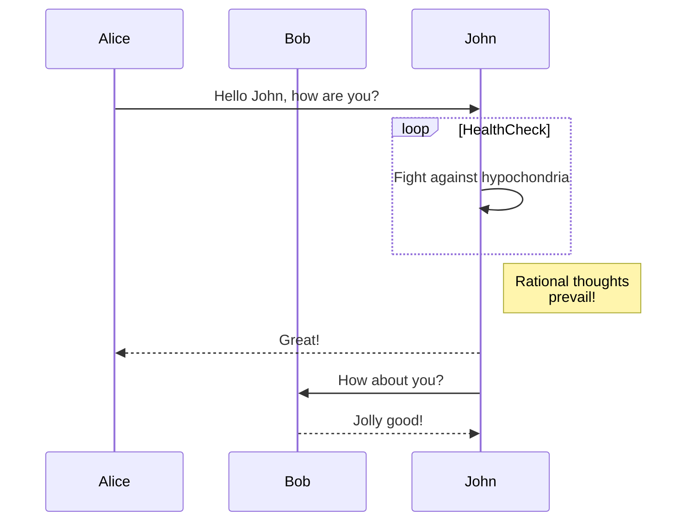
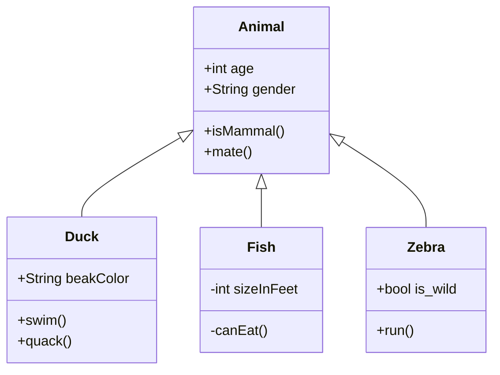

# Advanced Diagrams

This chapter shows more complex mermaid diagrams.

## Sequence Diagram



## Class Diagram



## Mathematics in Context

When analyzing algorithms, we often use Big O notation: $`O(n \log n)`$

The sum of a geometric series:

```math
\sum_{i=0}^{n} ar^i = a\frac{1-r^{n+1}}{1-r}
```
